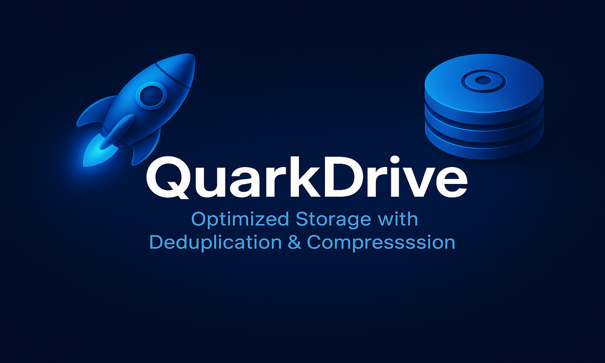

**Optimized Storage System with Deduplication and Compression**

QuarkDrive is an advanced storage solution that combines intelligent deduplication, efficient compression, and hybrid caching to maximize disk space efficiency and improve data access performance.

---

## ✨ Key Features

- 🔄 **Intelligent Deduplication** – Automatically removes duplicate files  
- 📦 **Advanced Compression** – Uses ZSTD for high-performance compression  
- ⚡ **C++ Extensions** – Optimized modules for maximum speed  
- 💾 **Hybrid Cache** – RAM + SSD cache system for fast access  
- 🖥️ **Graphical Interface** – Intuitive GUI built with PyQt5  
- 📁 **Virtual File System** – Transparent mounting via FUSE (Linux) or Dokan (Windows)  
- 📊 **Detailed Statistics** – Real-time performance monitoring  

---

## 🛠️ Installation

### ✅ Prerequisites

- Python 3.8+  
- Windows 10+ or Linux  
- 4GB RAM (recommended)  
- 1GB free disk space  

---

### 🚀 Quick Installation

```bash
# Clone the repository
git clone https://github.com/ON00dev/QuarkDrive.git
cd QuarkDrive

# Install dependencies
pip install -r requirements.txt

# Compile C++ extensions (optional but recommended)
python compile_extensions.py

# Run the application
python main.py gui
